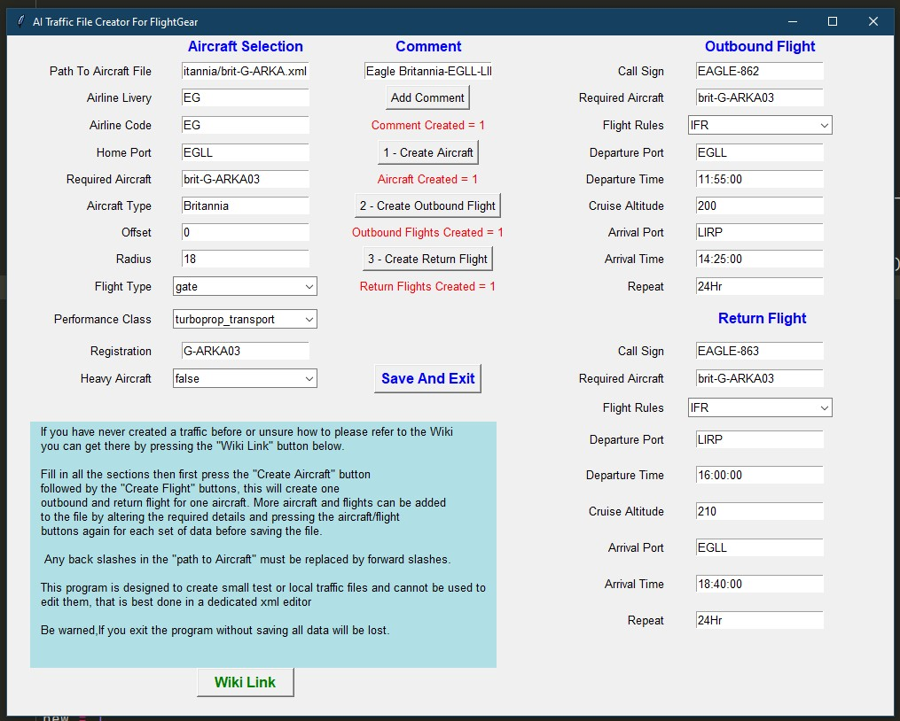

## AI Traffic Creator For FlightGear

###A simple Ai traffic creator for FlightGear flight simulator

### Requirements: Python 3 (written in 3.8)

I believe Linux and Mac already have Python installed by default but windows does not so it will need to be installed if you don't already have it.

The files should be extracted to any directory that has read/write permissions.

Traffic_Creator.py can be run either through an IDE or directly from the directory via the command line/terminal by typing "python Traffic_Creator.py" without the quotes.

 In windows you can open the terminal from the directory the files are in by clicking in the address bar and typing cmd then enter.

The program should be self explanatory if you have delt with traffic files before but if not I suggest reading up about them on the Wiki first. -
 [Wiki.flightgear](http://wiki.flightgear.org/AI_Traffic) (link also in program).

You can create as many aircraft and flights as you wish by filling in the details then pressing the "Create Aircraft Section" then "Create Flight Section", this process can be repeated as often as you like but remember to alter the relevant details so you don't end up with duplicate flights. 

All you need to enter is the actual text not the .xml tags they will be automatically entered when you save the file.

When finished save the file with the name of your choice, all being well it can be copied straight into your AI/Traffic folder and ready for use.

This is not an xml editor, it can not edit traffic files, I created it to quickly write test or local files so it's not really a program for writing airline schedules.

### Disclaimer
This is my first Python program so any errors and bugs are entirely down to me. ;)
